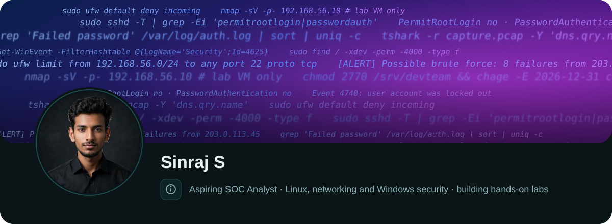
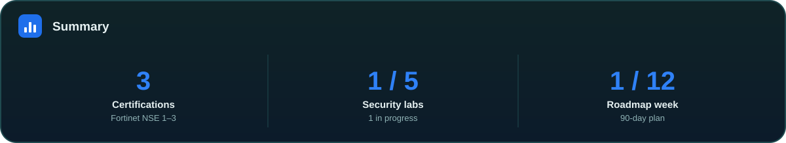
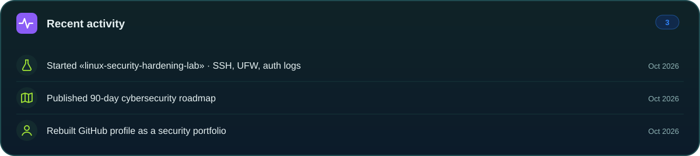

  

  
  
  
  

  
  
  
  
  
  

  

  

## About me

I'm a B.Tech graduate (2023) starting my career in **cybersecurity**, focused on security operations and defensive work. I currently work in property operations in the UAE, where I handle ticket tracking, technician coordination and reporting across a large building portfolio. That has taught me triage, clear documentation and follow-through, which I'm now applying to security.

This GitHub is my working portfolio. Each project is a hands-on lab I build in isolated virtual machines, documented step by step with commands, evidence and honest notes on what worked and what didn't.

**Looking for:** SOC Analyst L1 · Junior Cybersecurity Analyst · Junior Security Operations Analyst · IT Security Support · Junior Penetration Tester

## Skills

| Area | Current skills |
|------|----------------|
| **Linux** | Ubuntu & Kali Linux · users, groups and permissions · `systemd` services · package management · log files under `/var/log` · Bash scripting |
| **Networking** | OSI / TCP-IP · IPv4 subnetting and VLSM · VLANs and trunking · static routing · DHCP, DNS, NAT, practised in Cisco Packet Tracer |
| **Security** | Firewall and ACL fundamentals · port security · basic packet analysis · network scanning in my own lab |
| **Tools** | Wireshark · Nmap · Cisco Packet Tracer · VirtualBox · Git |
| **Scripting** | Bash · Java (basics, Selenium) |

**Learning now:** SSH and Linux hardening · SIEM monitoring with Wazuh · Windows Event Logs, Active Directory and Group Policy · vulnerability assessment.

## Certifications

| Certification | Status |
|---------------|--------|
| Fortinet NSE 1, 2 & 3 | Completed |
| Cisco CCNA | In progress |

## Security projects

| # | Project | What it demonstrates | Status |
|---|---------|----------------------|--------|
| 1 | **[linux-security-hardening-lab](https://github.com/sins05/linux-security-hardening-lab)** | Least-privilege users, permissions, key-only SSH, UFW firewall, auth-log brute-force detection, before/after audit | In progress |
| 2 | **soc-home-lab** | Wazuh SIEM, Linux log collection, failed-login investigation, alert triage, incident reports | Planned |
| 3 | **windows-security-lab** | Active Directory, Group Policy, Event Viewer (4625 / 4740), account lockout investigation, PowerShell auditing | Planned |
| 4 | **network-security-monitoring-lab** | Wireshark packet analysis, DNS and HTTP investigation, detecting scans in lab traffic | Planned |
| 5 | **vulnerability-assessment-lab** | Scoped scanning of a training target, CVSS triage, remediation and retest report | Planned |

Each project is linked here once its repository is published. It is marked **Completed** only after it has been run end to end with real evidence. All testing happens in isolated VMs I own; no real company data or credentials are ever committed.

**Foundations:** [CCNA-Notes](https://github.com/sins05/CCNA-Notes) · [Network-Lab](https://github.com/sins05/Network-Lab) · [Linux-Commands](https://github.com/sins05/Linux-Commands) · [Bash-Scripts](https://github.com/sins05/Bash-Scripts)

## 90-day roadmap

| Weeks | Focus | Outcome |
|-------|-------|---------|
| 1–2 | Linux hardening | Project 1: hardened Ubuntu server with before/after audit |
| 3–5 | Security monitoring | Project 2: Wazuh SIEM with two investigated incidents |
| 6–7 | Windows security | Project 3: AD domain, GPO, failed-logon and lockout investigation |
| 8–9 | Network monitoring | Project 4: packet captures and suspicious-traffic analysis |
| 10–11 | Vulnerability assessment | Project 5: scoped scan, remediation and retest report |
| 12 | Job readiness | Portfolio review, interview preparation, applications |

Weekly milestones and completion criteria are in **[ROADMAP.md](ROADMAP.md)**.

## Contact

Open to entry-level security roles in the UAE. The quickest way to reach me is [LinkedIn](https://www.linkedin.com/in/sinraj-s) or [email](mailto:sins.05s2002@gmail.com).

Header, summary and activity cards are generated by [`tools/make_assets.py`](tools/make_assets.py) and updated as each lab is completed.
